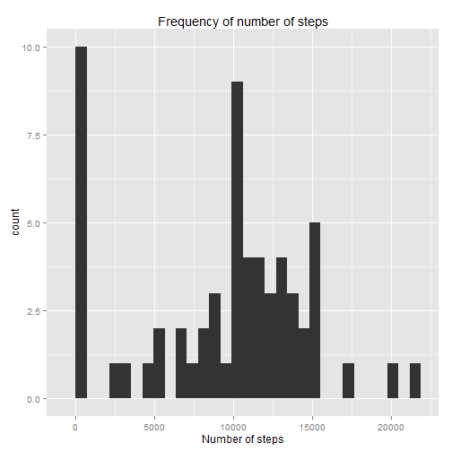
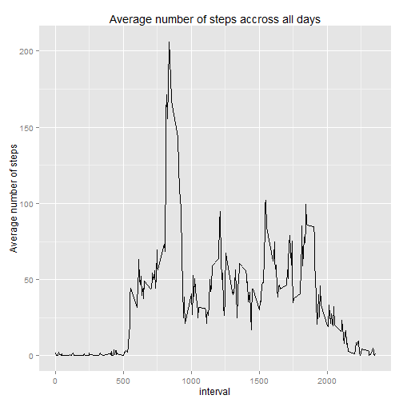
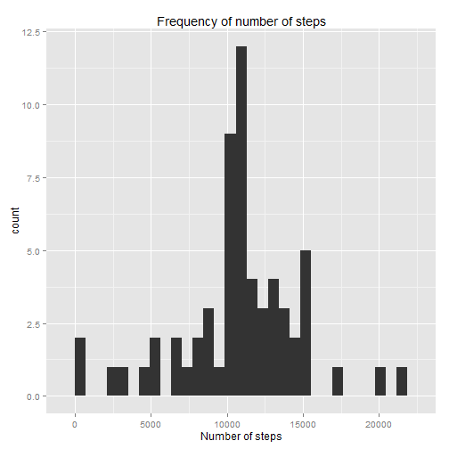
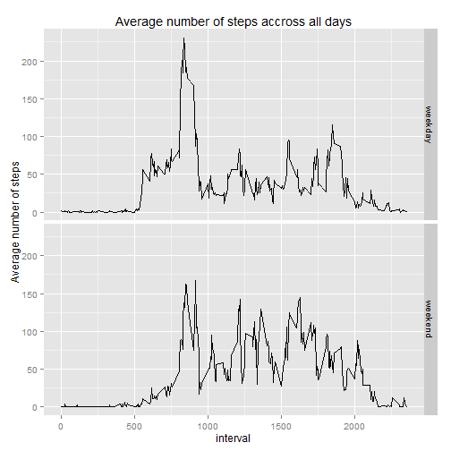

## Loading and preprocessing the data

```r
#library(data.table)
library(dplyr)
library(ggplot2)
library(lubridate)
```

1. Unzipping the file:

```r
unzip("activity.zip")
```


2. reading the data

```r
my_data <- read.csv("activity.csv")
```


*********** 


## What is mean total number of steps taken per day?

Let's first organize the data by grouping by date and summarize it while removing the NAs  

```r
my_grouped_data_day <- group_by(my_data, date)

my_summary_day <- summarize(my_grouped_data_day,
                            steps_sum = sum(steps, na.rm=TRUE))
```


Let's then make an histogram

```r
qplot(my_summary_day$steps_sum, geom="histogram", main="Frequency of number of steps", xlab="Number of steps")
```

 

We can calculate the mean and the median with:

```r
my_mean <- mean(my_summary_day$steps_sum)
my_median <- median(my_summary_day$steps_sum)
```

The mean of the total number of steps taken per day is **9354.23**.

The median of the total number of steps taken per day is **10395**.

**********


## What is the average daily activity pattern?

As we did before, let's begin by organizing the data

```r
my_grouped_data_int <- group_by(my_data, interval)

my_summary_int <- summarize(my_grouped_data_int,
                            steps_average = mean(steps, na.rm=TRUE))
```


We can than plot the data:

```r
qplot(interval, steps_average, data=my_summary_int, geom="line",
      main="Average number of steps accross all days",
      ylab="Average number of steps", xlab="interval")
```

 


We can retrieve the interval with the maximum number of steps with:

```r
my_max <- filter(my_summary_int, steps_average==max(steps_average))
```

The maxmimun number of steps is in the interval **835**


********

## Imputing missing values

To calculate the number of missing values we are going to add a column to the dataset indicating TRUE if there is a missing value and FALSE otherwise.


```r
my_data <- mutate(my_data, missing = is.na(steps))
```

The total number of missing value is obtained with the sum of the column 'mis', knowing that TRUE=1 and FALSE=0.

The total number of missing value is then:

```r
sum(my_data$mis)
```

```
## [1] 2304
```

We are going to replace all NAs by the mean steps during the corresponding 5-min interval. To do this, we are going to merge the original data with the summary that we computed earlier and which contains the column 'steps_average':


```r
my_data <- select(my_data, -missing)
my_data2 <- merge(my_data, my_summary_int)
```

We can than replace the NAs in the column 'steps' using the corresponding value in the 'steps_average':

```r
for(i in 1:length(my_data2$steps_average)) {
        if(is.na(my_data2$steps[i])) {
                my_data2$steps[i] <- my_data2$steps_average[i]
        }
}
```

By getting ride of the 'steps_average' column, we now have a new data set 'my_data2' which is the same as the original data set 'my_data' but with all the NAs filled.


```r
my_data2 <- select(my_data2, -steps_average)
```


We will now reuse the code from the first question to plot an histogram and calculate the mean and median:

```r
my_grouped_data2_day <- group_by(my_data2, date)

my_summary2_day <- summarize(my_grouped_data2_day,
                            steps_sum = sum(steps, na.rm=TRUE))

qplot(my_summary2_day$steps_sum, geom="histogram", main="Frequency of number of steps",xlab="Number of steps")
```

 

```r
my_mean2 <- mean(my_summary2_day$steps_sum)
my_median2 <- median(my_summary2_day$steps_sum)
```


The mean of the total number of steps taken per day is **10766.19**.

The median of the total number of steps taken per day is **10766.19**.

The mean and median are clearly different than the ones from the oroginal data set.


*********


## Are there differences in activity patterns between weekdays and weekends?
For this question we are using the 'lubridate' package:


```r
my_data2 <- mutate(my_data2, day = wday(ymd(date),label=TRUE))
```

Let's then create another column 'day2' assigning 'weekday' or 'weekend'

```r
my_data2 <- mutate(my_data2, day2="")

for(i in 1:length(my_data2$day)){
        if(my_data2$day[i]=="Sat"|my_data2$day[i]=="Sun"){
                my_data2$day2[i] <- "weekend"
        } else {
                my_data2$day2[i] <- "weekday"
        }
}

my_data2$day2 <- as.factor(my_data2$day2)
```


We are know going to arrange the data to prepare it for plotting:

```r
my_grouped_data2_int <- group_by(my_data2, interval, day2)

my_summary2_int <- summarize(my_grouped_data2_int,
                            steps_average = mean(steps))
```


We can than plot the data:

```r
qplot(interval, steps_average, data=my_summary2_int, geom="line", facets=day2~.,
      main="Average number of steps accross all days",
      ylab="Average number of steps", xlab="interval")
```

 

We see that there are slight differences, especially in the morning of weekends were there are less steps. However, there are more steps during the rest of the day.
